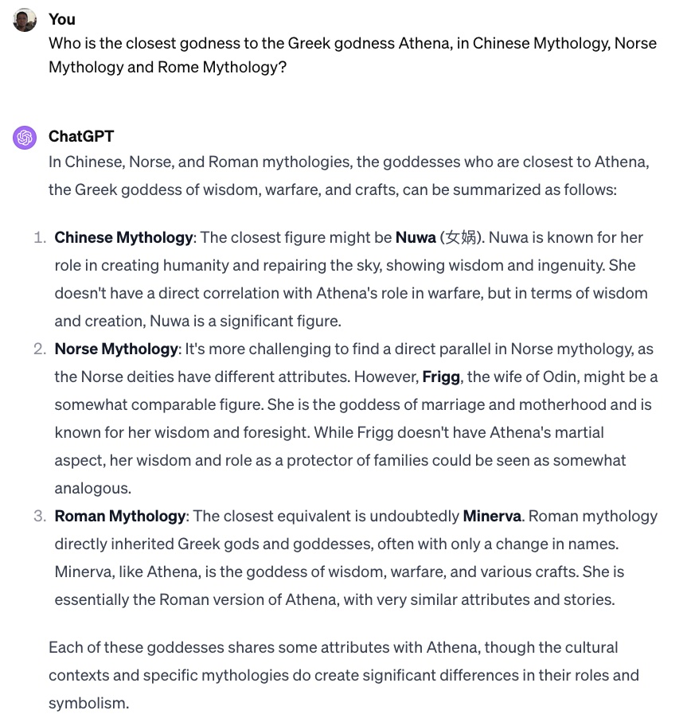
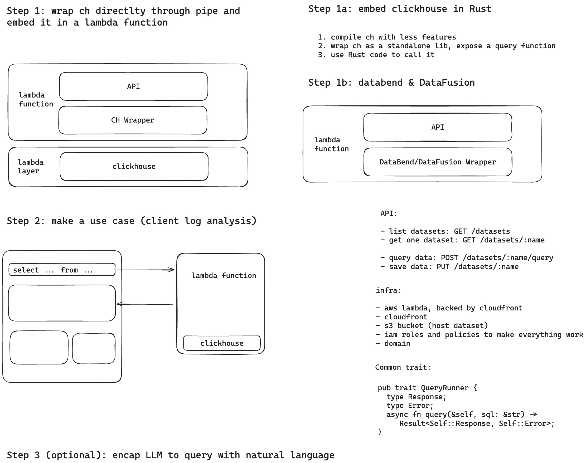
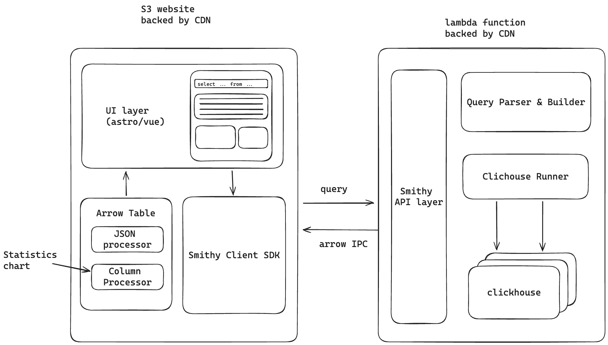

# Minerva

Minerva is a proof-of-concept, serverless tool that enables SQL-based analysis and visualization of data stored in S3, with potential future extensions to other data storage locations. It leverages technologies such as ClickHouse, Databend, and DataFusion for data processing. Each query is executed via an AWS Lambda function, making it a cost-effective solution for scenarios like log analysis. Minerva can be considered a light-weighted serverless alternative to AWS Athena.

## Why name it as Minerva?

## Initial thoughts

## Architecture

## Basic user experience

1. Data Selection: Upon loading the web frontend, users are presented with a list of datasets available for querying in a specified S3 bucket.
2. Query Writing: Users can select a dataset and write SQL queries in the provided editor.
3. Backend Processing: The query is transmitted to the backend, where a new AWS Lambda function is instantiated to execute it.
4. Results Display: The query results are returned to the frontend and displayed in a tabular format.
5. Basic Visualization: Users have the option to perform basic visualizations on the query results.
6. CSV Download: There is a feature to download the query results as a CSV file.
7. Dataset Saving (Optional): Users may choose to save the query results as a new dataset in the S3 bucket.
8. Query History: The history of the user's queries is stored in the browser's local storage. If feasible, this data may also be stored on the backend.

## Query backend

We'd like to try different query backends, including:

- [ClickHouse](https://github.com/ClickHouse/ClickHouse): The main target. Initially, we plan to use a zipped ClickHouse build, approximately 170MB in size, as a Lambda layer to serve as our query backend (phase 1). If this approach proves successful, our next step will be to create a custom ClickHouse build, incorporating only the essential components, and then integrate it with our Rust code. The primary challenge here is navigating CMake and C++ coding to determine how to build only the necessary components (phase 2).
- [Databend](https://github.com/datafuselabs/databend): A Rust-based alternative to ClickHouse. The challenge lies in discerning how to isolate and extract the essential components from its source code to form a Rust library to be used in the lambda function.
- [DataFusion](https://github.com/apache/arrow-datafusion): A Rust-based SQL engine that is user-friendly and easily embeddable. While it may not match the performance levels of ClickHouse, we intend to use it as a baseline for comparisons with ClickHouse and Databend.

## Tasks

Day 1:

- [x] tchen: init the repo with the initial doc
- [x] tchen: init the project layout (considering using smithy for APIs)
- [x] xinwei: data fusion related work
- [x] tchen: prepare the environment (deployment scripts)
- [x] tchen: API

Day 2:

- [x] tchen: web frontend
- [x] tchen: make a minimal working example
- [x] xinwei: databend related work
- [x] tchen: clickhouse phase 1 related work
- [ ] tchen/xinwei: clickhouse phase 2 related work
- [x] xinwei: slides for the presentation
- [x] xinwei: demo video
- [x] tchen: AI assisted query suggestions
  - [ ] the result is not good so the component is not used in the demo
